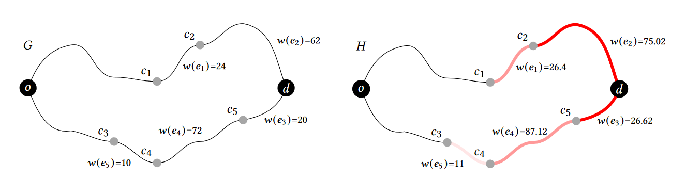
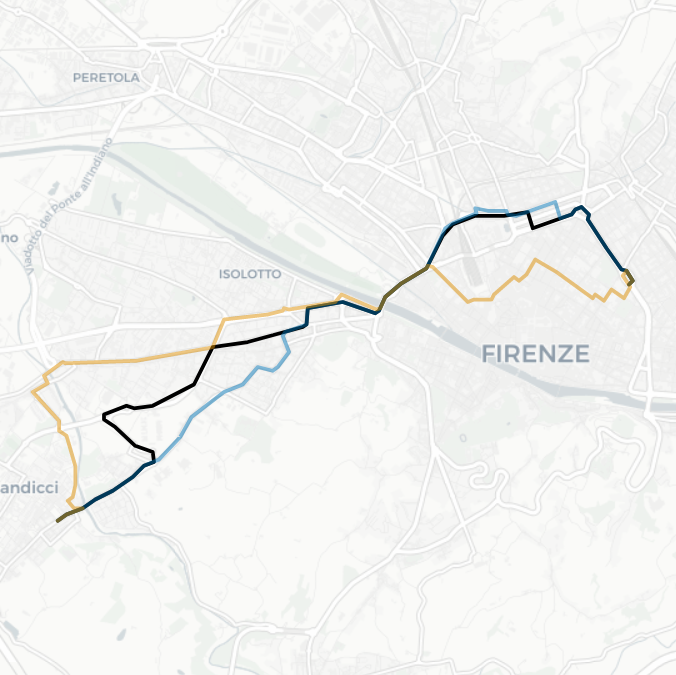

# One-Shot Traffic Assignment with Forward-Looking Penalization

<div align="center">
  
</div>

____

Authors: Giuliano Cornacchia, Mirco Nanni, and Luca Pappalardo.

Pre-print available [here](https://arxiv.org/abs/2306.13704).


This repository contains the Python code necessary to replicate the analysis conducted in our work on METIS, a cooperative, one-shot Traffic Assignment (TA) algorithm. METIS utilizes alternative routing, edge penalization, and informed route scoring techniques to assign routes to trips with the goal of reducing the overall CO2 emissions.

We employ SUMO, a mobility simulator, to simulate the impact of the routes generated by METIS, as well as several baseline algorithms. To use the code and reproduce the analysis, follow the instructions provided in this README file.


```
Cornacchia, Giuliano, Mirco Nanni, and Luca Pappalardo.
One-Shot Traffic Assignment with Forward-Looking Penalization.
arXiv preprint arXiv:2306.13704 (2023).
```

If you use the code in this repository, please cite our paper:

```
@misc{cornacchia2023oneshot,
      title={One-Shot Traffic Assignment with Forward-Looking Penalization}, 
      author={Giuliano Cornacchia and Mirco Nanni and Luca Pappalardo},
      year={2023},
      eprint={2306.13704},
      archivePrefix={arXiv},
      primaryClass={cs.MA}
}
```

## Abstract

Traffic assignment (TA) is crucial in optimizing transportation systems and consists in efficiently assigning routes to a collection of trips. Existing TA algorithms often do not adequately consider real-time traffic conditions, resulting in inefficient route assignments. This paper introduces METIS, a cooperative, one-shot TA algorithm that combines alternative routing with edge penalization and informed route scoring. We conduct experiments in several cities to evaluate the performance of METIS against state-of-the-art one-shot methods. Compared to the best baseline, METIS significantly reduces CO2 emissions by 18% in Milan, 28\% in Florence, and 46% in Rome, improving trip distribution considerably while still having low computational time. Our study proposes METIS as a promising solution for optimizing TA and urban transportation systems. 


## Usage

1. Install the required dependencies in the provided requirements.txt
2. Execute the metis.py script to perform the traffic assignment as `python metis.py [arguments]` <br>
For example: <br>
  `python metis.py -d demand.json -n network.net.xml -o ./output/ -i metis -s 2 -p 0.01`


Parameter Description:

| Parameter   | Description                                                          | Required | Default Value | Example            |
|-------------|----------------------------------------------------------------------|----------|---------------|--------------------|
| demand      | Path to the file containing the mobility demand.                      | Yes      | N/A           | `-d demand.json`   |
| net         | Path to the SUMO road network file.                                   | Yes      | N/A           | `-n network.net.xml` |
| tilesize    | Tile size used for partitioning the road network (in meters).         | No       | 1000          | `-t 1000`          |
| slowdown  | Slowdown parameter used in the FLEP algorithm.                          | No       | 2             | `-s 2`             |
| p           | Penalization factor used in the FLEP algorithm.                       | No       | 0.01          | `-p 0.01`          |
| attribute   | Name of the attribute representing the edge property in the graph.    | No       | "traveltime"  | `-a traveltime`    |
| k           | Number of candidates generated using KMD (KMDNSP).                    | No       | 3             | `-k 3`             |
| eps         | Epsilon value used in the KMD algorithm.                              | No       | 0.3           | `-e 0.3`           |
| out         | Output directory path to save the results.                            | Yes      | "./"          | `-o ./output/`     |
| identifier  | Identifier for the output files.                                      | No       | "metis"       | `-i metis_results` |


3. To simulate with the traffic simulator SUMO the impact of a collection of routes on CO2 emissions, execute the following command:


## HOW DOES METIS WORK?

METIS is a one-shot Traffic Assignment algorithm designed to optimize routing decisions in transportation systems. It aims to minimize CO2 emissions and improve overall network performance by assigning routes to trips.

METIS achieves this through three interconnected phases:

1. FLEP (Forward-Looking Edge Penalization): FLEP estimates the position of each vehicle and applies penalties only to unvisited edges in real-time. By considering the dynamic traffic conditions, FLEP ensures accurate penalization, leading to more informed routing decisions.

2. Route Candidates Generation: K-most diverse near shortest path (KMD), a state-of-the-art AR method, generates a set of candidate routes between the trip's origin and destination. By considering multiple destinations and computing the shortest paths, KMD provides a range of potential routes for assignment.

3. Route Scoring: The route scoring phase assigns scores to the candidate routes based on various factors, including the K-road measure and road capacity. This measure characterizes the routes in terms of their constituent edges, allowing for evaluation based on origin, destination, and road capacity. The scoring function helps select the most optimal route for assignment.

These phases work together in METIS to optimize routing decisions. FLEP ensures accurate penalization based on real-time occupancy, KMD generates diverse candidate routes, and route scoring evaluates the suitability of each route. This integrated approach improves trip distribution, reduces congestion, and ultimately enhances the efficiency of urban transportation networks.


### 1. FLEP (Forward-Looking Edge Penalization)

FLEP is an innovative approach designed to optimize routing decisions in transportation systems. 

In traditional routing algorithms, the entire previously assigned route is penalized when making new routing decisions. However, FLEP takes a more precise and dynamic approach. Instead of penalizing the entire route, FLEP estimates the position of each vehicle at a given time instant and applies penalties only to the unvisited edges. This enables a more accurate representation of real-time traffic conditions and allows for better-informed routing decisions.

Assuming that a vehicle departed $t$ seconds ago, FLEP computes the distance it has travelled during $t$ seconds, assuming that the vehicle travelled at a speed of $\frac{max\_{speed}}{s}$ on each edge, where $s$ is a slowdown parameter accounting for reduced speeds on edges due to the presence of other vehicles and various
events like traffic lights. 
Then, FLEP modifies the weights $w(e)$ assigned to the edges that the vehicle is expected to traverse by
applying a penalty factor $p$: $w(e) \leftarrow w(e) \cdot (1+p)$. The penalization is cumulative, i.e., the edge is penalized for each vehicle that will
traverse that edge. This penalization discourages the selection of edges that vehicles are likely to traverse, promoting alternative
routes and a balanced distribution of traffic.

<div align="center">
  
</div>


### 2. KMD

$k$-Most Diverse Near Shortest Paths (KMD) is an AR algorithm that generates a collection of $k$ routes with the highest dissimilarity among each other while still adhering to a user-defined cost threshold $\epsilon$. 
Given an origin $o$ and a destination $d$, KMD first calculates the fastest path between $o$ and $d$. 
The cost $c$ of this path, along with the parameter $\epsilon$, determines the maximum allowed cost threshold $c \cdot (1+\epsilon)$ for a path to be considered near-shortest.
Through the route candidate generation phase, METIS ensures that a comprehensive set of candidate routes is available for evaluation. This enables the subsequent phases of the algorithm to consider multiple options and select the most optimal route based on a specific criteria.
In this study, we use parameter values $k = 3$ (three alternative routes) and $\epsilon = 0.3$ (maximum cost increase of 30% compared to the fastest path) for KMD. 
These parameter values are commonly used in alternative routing algorithms.

<div align="center">
  
</div>


### 3. Route Scoring

METIS scores and ranks the set of alternative routes generated by KMD. 
This phase plays a vital role in selecting the most optimal route for assignment based on various criteria.

To determine the best route among the alternatives, METIS assigns a score (the lower, the better) to each route $r$ based on the following formula:
$score(r) = \frac{K_{\text{road}}^{\text{\tiny(source)}}(r) \cdot K_{\text{road}}^{\text{\tiny(end)}}(r) }{C_r}$

where $C_r$ is the average of the capacities $C(e)$ of the edges in route $r$, taking into account the edge length, $K_{\text{road}}^{\text{\tiny(source)}}(r)$ and $K_{\text{road}}^{\text{\tiny(end)}}(r)$ represents the K-road origin and K-road destination of route r, respecitevly. In a nutshell, the K-road number indicates the "popularity" of a route among different driver areas (e.g., neighbourhoods). 

By evaluating the route score using this formula, METIS can prioritize routes that demonstrate a balance between popularity and road capacity. This scoring approach helps in selecting the most optimal route, considering various factors such as environmental impact, network efficiency, and user preferences.


## Setup

## How to install and configure SUMO (Simulation of Urban MObility) 🚗🚙🛻

### Install SUMO

Please always refer to the [SUMO Installation page](https://sumo.dlr.de/docs/Installing/index.html)
for the latest installation instructions.

#### > Windows

To install SUMO on Windows it is necessary to download the installer [here](https://sumo.dlr.de/docs/Downloads.php#windows) and run the executable.

#### > Linux

To install SUMO on Linux is it necessary to execute the following commands:

```
sudo add-apt-repository ppa:sumo/stable
sudo apt-get update
sudo apt-get install sumo sumo-tools sumo-doc
```

#### > macOS

SUMO can be installed on macOS via [Homebrew](https://brew.sh/).

You can install and update Homebrew as following:

```
/bin/bash -c "$(curl -fsSL https://raw.githubusercontent.com/Homebrew/install/master/install.sh)"
brew update
brew install --cask xquartz
```
To install SUMO:
```
brew tap dlr-ts/sumo
brew install sumo
```


### Configure SUMO

After installing SUMO you must configure your `PATH` and `SUMO_HOME` environment variables.

Suppose you installed SUMO at `/your/path/to/sumo-<version>`

#### > Windows
1. On the Windows search box search for "Edit the system environment variables" option and open it;
2. Under user variables select `PATH` and click Edit. If no such variable exists you must create it with the New-Button; 
3. Append `;/your/path/to/sumo-<version>/bin` to the end of the `PATH` value (do not delete the existing values);
4. Under user variables select `SUMO_HOME` and click Edit. If no such variable exists you must create it with the New-Button;
5. Set `/your/path/to/sumo-<version>` as the value of the `SUMO_HOME` variable.

#### > Linux

1. Open a file explorer and go to `/home/YOUR_NAME/`;
2. Open the file named `.bashrc` with a text editor;
3. Place this code export `SUMO_HOME="/your/path/to/sumo-<version>/"` somewhere in the file and save;
4. Reboot your computer.


#### > macOS

First you need to determine which shell (bash or zsh) you are currently working with. In a terminal, `type ps -p $$`.

##### ZSH

In a Terminal, execute the following steps:

1. Run the command `open ~/.zshrc`, this will open the `.zshrc` file in TextEdit;
2. Add the following line to that document: `export SUMO_HOME="/your/path/to/sumo-<version>"` and save it;
3. Apply the changes by entering: `source ~/.zshrc`.

##### bash

In a Terminal, execute the following steps:

1. Run the command `open ~/.bash_profile`, this will open the `.bash_profile` file in TextEdit;
2. Add the following line to that document: `export SUMO_HOME="/your/path/to/sumo-<version>"` and save it;
3. Apply the changes by entering: `source ~/.bash_profile`.
